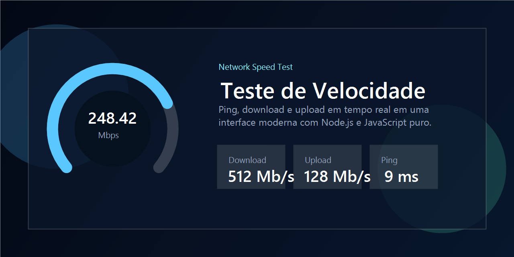

# Teste de Velocidade



Aplicacao web para medir ping, download e upload em tempo real com interface moderna no navegador e servidor local em Node.js.

## Visao geral

O projeto simula a experiencia de um velocimetro de rede com medicao de latencia, download e upload em tempo real. A interface foi criada em HTML, CSS e JavaScript puro, enquanto o backend usa Node.js para fornecer os endpoints de teste e servir a aplicacao localmente.

## Destaques

- Interface moderna com gauge central e indicadores em tempo real
- Medicao de ping, jitter, perdas, download e upload
- Historico resumido da sessao no navegador
- Estrutura organizada para manutencao e evolucao
- Servidor local com configuracao mais segura para desenvolvimento

## Tecnologias

- HTML5
- CSS3
- JavaScript Vanilla
- Node.js com modulo `http`

## Estrutura do projeto

```text
.
|-- public/
|   |-- index.html
|   `-- assets/
|       |-- css/
|       |   `-- style.css
|       `-- js/
|           `-- script.js
|-- src/
|   `-- server/
|       `-- server.js
|-- .gitignore
|-- package.json
`-- README.md
```

## Como executar

### Requisitos

- Node.js 18+ instalado

### Passos

```bash
npm install
npm start
```

Depois, abra:

```text
http://127.0.0.1:3000
```

## Scripts disponiveis

- `npm start`: inicia o servidor da aplicacao
- `npm run dev`: inicia o servidor usando a mesma entrada principal do projeto

## Endpoints do servidor

- `GET /health`: valida se o servidor esta ativo
- `GET /ping`: responde rapidamente para calculo de latencia
- `GET /download`: envia fluxo de dados para medir download
- `POST /upload`: recebe carga binaria para medir upload

## Objetivo do projeto

Este projeto e uma base enxuta para estudos de redes, interfaces em tempo real e organizacao de aplicacoes web sem frameworks. A estrutura foi separada para facilitar manutencao, evolucao e publicacao no GitHub.

## Checklist de publicacao segura

- Nao versionar arquivos `.env`, chaves privadas ou credenciais.
- Manter `node_modules/` fora do repositorio.
- Publicar apenas arquivos necessarios para execucao da aplicacao.
- Revisar futuras integracoes com APIs para evitar chaves no frontend.
- Preferir execucao local em `127.0.0.1` durante desenvolvimento.

